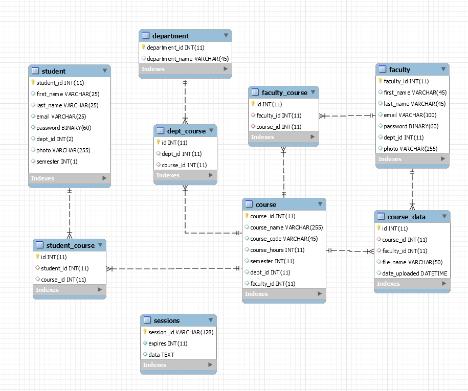

<h2>Database Systems Lab Project for Semester 4 at DHA Suffa University.</h2>

After cloning,
<ol>
	<li>Create a database called "epiclms" on your local SQL server</li>
	<li>Import epiclms.sql into the database</li>
	<li>npm install (to install dependencies)</li>
	<li>npm start (to start server on localhost:3000 using nodemon)</li>
<ol>
<h3>Database Schema</h3>

